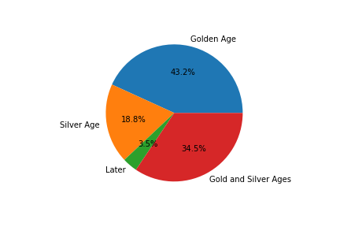

# Final Report for Latin-Vocabulary-Analysis
## Frances Harrington, frh19@pitt.edu, 5/2/2021
# Overall History and Process
   I decided to do this project after realizing that my first idea would not work. My first idea was about an analysis of worldwide candy sales, but there was not a sufficient linguistic component. This project was one that I picked because I was already familiar with Latin as a language, and I wanted to work within a sphere that I was already comfortable with. After determining the basis I chose this specific topic because I was aware of the amount of synonyms for the English word "sword". It was certainly the computational part rather than the linguistic part that I expected to challenge me the most throughout this project. My process consisted of a few general steps: acquiring the data, cleaning/formatting the data, and analyzing the data. By far the toughest part of this was the acquisition and cleaning/formatting the data. Once I was able to build a successful [spider](https://github.com/Data-Science-for-Linguists-2021/Latin-Vocabulary-Analysis/blob/main/LatLibSpider.ipynb) I built two DataFrames for use in the [analysis portion](https://github.com/Data-Science-for-Linguists-2021/Latin-Vocabulary-Analysis/blob/main/AnalysisCode.ipynb). Even afterthe initial acquisition I had some difficulty which I will expand on later in this reflection. I then worked to organize the data based on the specific vocabulary. My analysis focused on the breakdown of the data between style (prose/verse), era (gold, silver, later), and, finally, with regards to ngrams. Overall this project was a difficult but extremely rewarding process.
# Data
   As I mentioned above, here is where I will expand on my data: its acquisition, cleaning, formatting, and overall content. I wrote my [spider](https://github.com/Data-Science-for-Linguists-2021/Latin-Vocabulary-Analysis/blob/main/LatLibSpider.ipynb) in Jupyter Notebook because I figured that this would be the easiest way to keep all of my files in one place as well as the fact that throughout this semester I have become comfortable using Jupyter Notebook to write programs. I scraped [The Latin Library website](https://www.thelatinlibrary.com/) for as many texts as I could, which ended up being 672. Building this was tricky, but with the help of Joey and the Scrapy tutorial on DataCamp I was able to collect texts, titles, author names, and their life spans.
   
   The most difficult part of scraping the data was storing it into an acceptable format in DataFrames. By using empty lists to deposit the data in and then combining all of those lists into two DataFrames I was able to store it in an acceptable fashion. I say two DataFrames because one DataFrame contained, initially, the text and title while the second one contained each author's name and their life span. It was easier to initialize two DataFrames and then combine them because there were more items in the text/title DataFrame than in the author/life span DataFrame. Both the cleaned and uncleaned versions of the texts were kept in the DataFrame for analysis purposes which I will expand on in my analysis section later. Including these four categories (text, title, author, author's life span) that I gleaned from the scraping of the website, I also created a few categories of my own. As shown in the [analysis portion](https://github.com/Data-Science-for-Linguists-2021/Latin-Vocabulary-Analysis/blob/main/AnalysisCode.ipynb) of my project, I also created DataFrame columns for tokens, token count, maximum line length, style, and era. Each of these categories were used in my analysis.
   
   These categories were added to the DataFrame using the .map() function as well as some methods. Tokens and token count were done with NLTK's built-in functions. Style was quantified by using the measurements taken from maximum line length to generate a threshold between works written in prose (longer/continuous lines) and those written in verse (shorter lines). Era was determined by using a method to categorize each author based on their life span into the commonly used markers of "Golden Age" (70 BC–18 AD), "Silver Age" (18 AD–133 AD), "Later" (133 AD on), and "Both Golden and Silver Ages" (writers that composed in both the Golden and Silver ages). 
   
   Once I had my categories set the next part involving data cohesion was to organize the data based on which "sword word" appeared in the texts. The words--gladius, ferrum, mucro, ensis, capulus, and all of their forms--were used to construct five new DataFrames containing all of the information present in the main DataFrame. Each of these new DataFrames only consist of works wherein the word in question appears.
   
   With the data organized, next I will cover my analysis portion of the project.
# Analysis
   The analysis portion of my project took place entirely in my [Analysis JupyterNotebook](https://github.com/Data-Science-for-Linguists-2021/Latin-Vocabulary-Analysis/blob/main/AnalysisCode.ipynb). Here I looked into the overall split of the data between , , as well as the more specific analysis of the "sword words".
   
   While looing at the specific vocabulary I also charted the prose/verse splits and era splits for each word usage which can be found in my images folder [here](https://github.com/Data-Science-for-Linguists-2021/Latin-Vocabulary-Analysis/tree/main/Images). For viewing here, here is a look at the prose/verse split for the word  and . Here are some era breakdowns for  and . I learned that prose tends to be the style of choice overwhelmingly except in the case of the word "capulus" which has about a 70-30 split in favor of verse. When it comes to eras, the smallest category is regularly "Later" which makes sense as the website contains the least amount of those texts. The Golden Age and both the Gold/Silver Ages tend to come out on top for era divisions for all words. Again, this is because those categories make up the majority of the works used. 
   
   In addition to these aspects, I also examined the bigrams and trigrams of each word. I was initially hesitant to take this approach as Latin, being a case based language, doesn't always mean that the words that modify one another are adjacent. However, Na-Rae advised after my presentation that I look into it and she was right. I found some interesting patterns. Of course, stop words (or what could be considered a stop word in Latin) appear a lot with all words. Verbs of violence such as "kill" "wound" "cut off" "drive" "attack" all appear multiple times in ngrams. Similarly, adjectives that connote violence such as "bloody" "flaming" and "rigid" also appear multiple times in the ngrams. The code and Latin terminology can be found in my [analysis portion](https://github.com/Data-Science-for-Linguists-2021/Latin-Vocabulary-Analysis/blob/main/AnalysisCode.ipynb). I understand that the code that I built to accomplish this is not very pretty, but unfortunately this was just the easiest way that came to my mind.
   
   Overall throughout this analysis I ahve gained a better understanding of the connotations and usages of these words.
# Presentation
   [My presentation](https://github.com/Data-Science-for-Linguists-2021/Latin-Vocabulary-Analysis/blob/main/Latin_Linguistic_Analysis_Presentation.pdf) covered most of what I described in my above sections, albeit in lesser detail. I ahdn't done any of the ngram analysis at that point and my organization of my documents was not where it is now. I also hadn't imaged all of the charts now stored in my [images](https://github.com/Data-Science-for-Linguists-2021/Latin-Vocabulary-Analysis/tree/main/Images) folder. My presentation was not as long as it should have been--in part due to the fact that I rusched through my notes--but also because I could have expanded more on my process.
# Conclusion
   This project was hard work, but was also very rewarding to complete! The data was tricky to work with, but once I got the hang of it things went a lot smoother. I was able to apply a lot of what we learned this semester as well as what we covered in LING1330. Many thanks to Na-Rae and JOey for answering my questions and helping me to build this project!